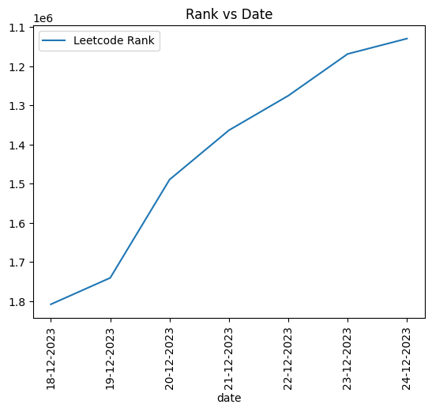

I started Leetcode in 2023. I want to have a track of how my rank changes with the course of time. 

Leetcode provides a rank vs time graph, but I wanted to make something myself.

The end-to-end thing contains three components

- A python script that will fetch the rank from LeetCode website.
- A batch script that will run the script within proper Python environment, since web scrapping libraries like bs4 do not come pre-installed with Python.
- Task Scheduler
  - Create ```Basic Task```, give a name to it. Choose its frequency in trigger section.
  - Choose ```_start a program_``` in Actions.
  - In Program/Script, provide path to the bat file. Also put ```"C:/"``` in the ```Start in (Optional)```. Even though it says optional, it's actually mandatory.
  - Finish

***********************************************

<p align='center'>
  
</p>

And this stupid code betrayed me. There was some error and it wiped out 2 months of rank-tracking. Will be careful with data-writing next time. Here's the latest version I had plotted.

*******************************************
- Restored 65% of the data, but the rest seem lost forever. Mostly data of first half of February. Better than losing it all, but still a loss.
- A good lesson for me, to put additional checks, especially if we're writing a file from scratch. I've modified the retrieval script, will try it and update.

- This code is not working anymore. Leetcode has apparently updated its policy, and now I can't scrap content from Leetcode anymore. It's likely the same for all, since I'm facing the same problem in my own system and on Colab as well. 
